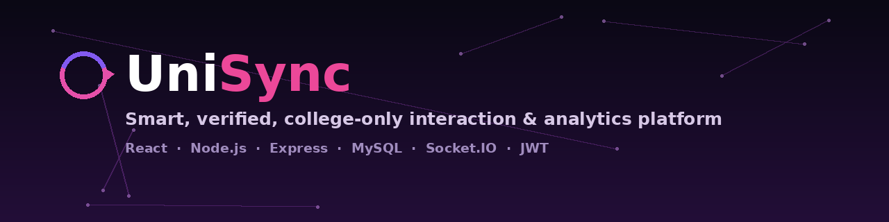
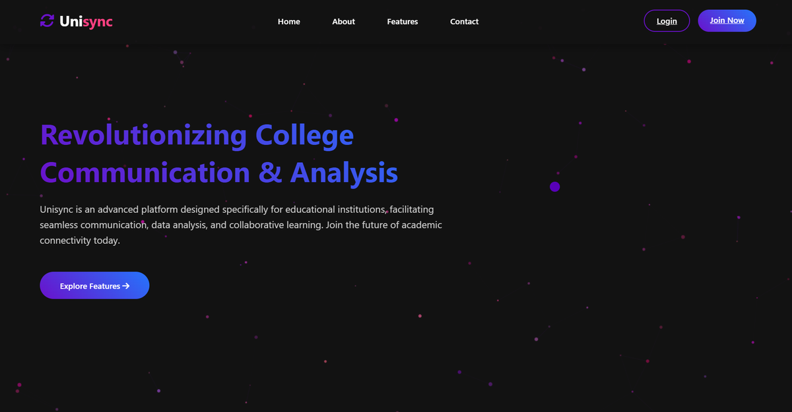
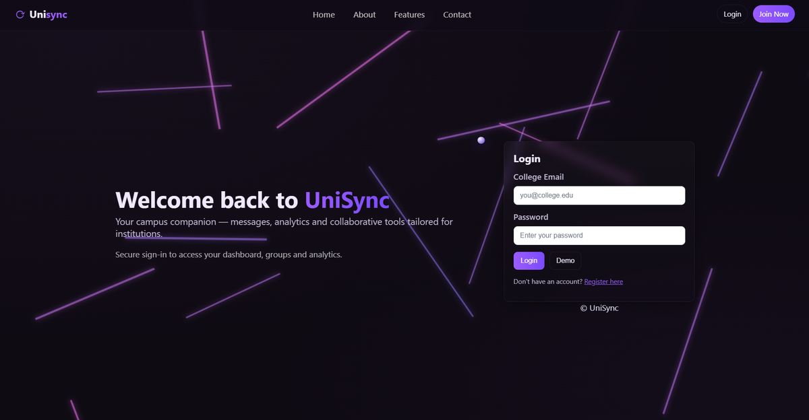
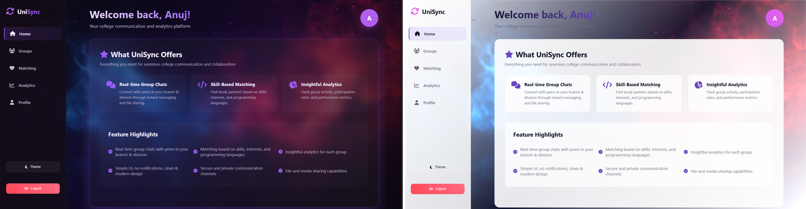
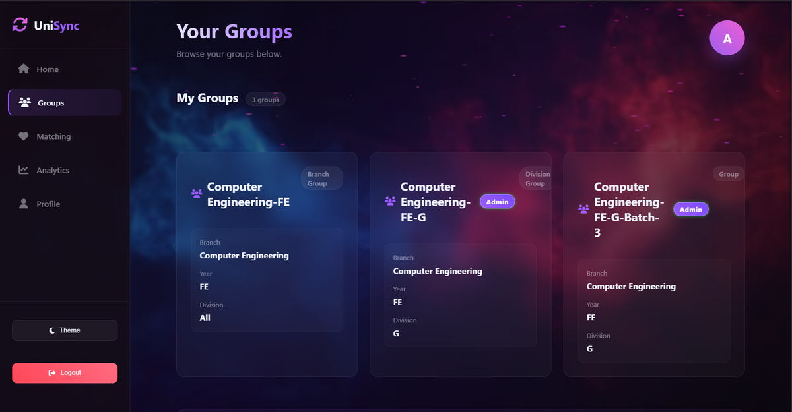
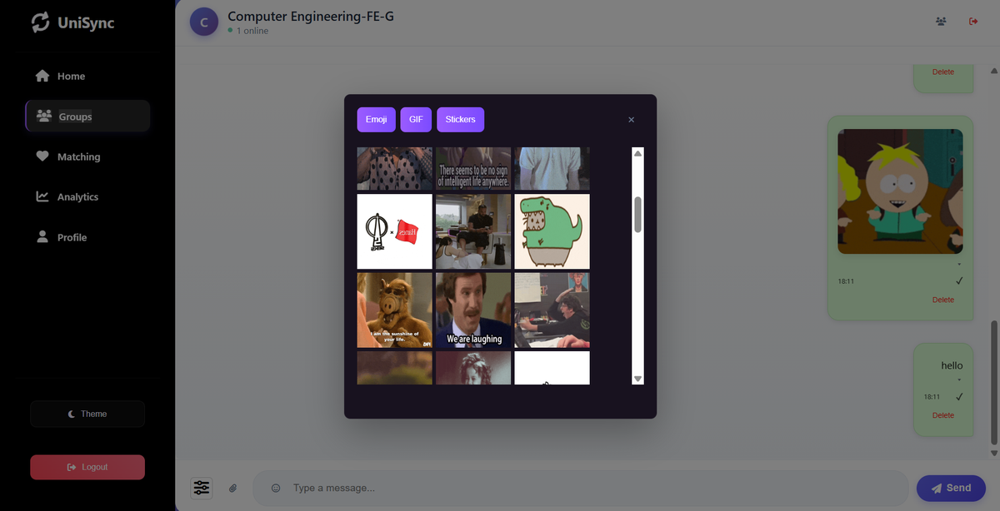
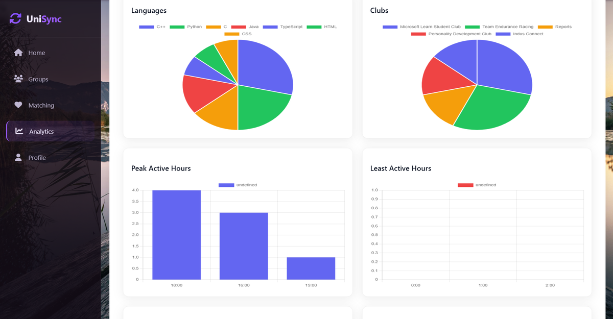

<p align="center">
  
</p>

<h1 align="center">UniSync</h1>

<p align="center">
  A smart, verified, college-only interaction and analytics platform — real-time messaging,
  skill-based matching, and engagement analytics for a student community.
</p>

<p align="center">
  
  
  
  
  
  
  
</p>

<p align="center">
  <a href="#overview">Overview</a> ·
  <a href="#features">Features</a> ·
  <a href="#screenshots">Screenshots</a> ·
  <a href="#tech-stack">Tech Stack</a> ·
  <a href="#architecture">Architecture</a> ·
  <a href="#getting-started">Getting Started</a> ·
  <a href="#project-layout">Project Layout</a>
</p>

---

## Overview

UniSync is a real-time communication and analytics platform built for a single college community. Students sign in with a **college email verified by OTP**, join branch/division/batch-based groups, chat in real time, get matched with peers by skills and interests, and see their own engagement surfaced back to them through an analytics dashboard.

It was built as a solo effort within a team-assigned semester project — backend, frontend, real-time messaging, and analytics were all designed and implemented independently.

## Features

- 🔐 **Verified college-only access** — signup restricted to college email addresses, with OTP email verification before an account is active
- 💬 **Real-time messaging** — group and private chats over Socket.IO, with attachments, emoji/GIF/sticker pickers, and message delivery ticks
- 👥 **Auto-generated groups** — branch, division, and batch groups created automatically, with admin roles per group
- 🤝 **Skill-based matching** — find peers by skills, interests, and programming languages
- 📊 **Engagement analytics** — per-user dashboards charting languages used, club involvement, and peak/least active hours
- 🌗 **Full light/dark theme system** across every screen, not just a color inversion
- 🖼️ **Media uploads** — Cloudinary-backed file/image sharing in chat via Multer
- 🔑 **JWT-based sessions** with bcrypt password hashing

## Screenshots

**Landing Page**



**Login — OTP-Verified College Email**



**Home Dashboard — Dark & Light Themes**



**Groups**



**Real-Time Chat**



**Engagement Analytics**



## Tech Stack

| Layer | Technology |
|---|---|
| Frontend | React.js |
| Backend | Node.js, Express.js |
| Database | MySQL (`mysql2`) |
| Real-time | Socket.IO |
| Auth | JSON Web Tokens, bcrypt password hashing |
| Email / OTP | Nodemailer |
| File uploads | Cloudinary + Multer (`multer-storage-cloudinary`) |
| HTTP client | Axios |

*(from the project's own `package.json` — `unisync-backend`: "UniSync Backend Server with OTP, Login, Groups, Chats, Matching, Analytics")*

## Architecture

```
┌────────────┐   REST API (JWT)   ┌──────────────────┐        ┌──────────────┐
│            │ ─────────────────▶ │                    │ ────▶ │    MySQL      │
│   React    │                    │  Express Backend   │        │  (users,      │
│  Frontend  │◀────────────────── │    (server.js)      │◀────  │   groups,     │
│            │   Socket.IO (WS)   │                    │        │   messages)   │
└────────────┘ ◀════════════════▶ └──────────────────┘        └──────────────┘
                                          │        │
                                          ▼        ▼
                                   ┌───────────┐ ┌──────────────┐
                                   │ Nodemailer │ │  Cloudinary   │
                                   │ (OTP email)│ │ (file uploads)│
                                   └───────────┘ └──────────────┘
```

- **Auth** — signup/login issue a JWT; passwords are hashed with bcrypt; new accounts are verified via a one-time password sent through Nodemailer to the student's college email.
- **Real-time messaging** — Socket.IO handles group and private chat delivery, typing/online status, and message events, separate from the REST API used for everything else.
- **Groups** — branch/division/batch groups are created automatically from a student's profile data, with per-group admin permissions.
- **Matching** — peers are surfaced based on shared skills, interests, and programming languages stored on each profile.
- **Analytics** — engagement data (languages, clubs, active hours) is aggregated server-side from stored profile and activity data and charted on the frontend.
- **Media** — chat attachments and uploads go through Multer to Cloudinary rather than being stored on the app server.

## Getting Started

```bash
git clone https://github.com/vitthal-hash/UniSync-ASEP.git
cd UniSync-ASEP
```

### Backend

```bash
npm install
```

Create a `.env` file in the project root:

```env
PORT=5000
DB_HOST=<mysql-host>
DB_USER=<mysql-user>
DB_PASSWORD=<mysql-password>
DB_NAME=unisync
JWT_SECRET=<any long random string>
CLOUDINARY_CLOUD_NAME=<cloudinary-cloud-name>
CLOUDINARY_API_KEY=<cloudinary-api-key>
CLOUDINARY_API_SECRET=<cloudinary-api-secret>
EMAIL_USER=<sender email for OTPs>
EMAIL_PASS=<app password for the sender email>
```

```bash
npm run dev   # nodemon server.js
# or
npm start     # node server.js
```

### Frontend

```bash
cd frontend
npm install
npm start
```

The frontend expects the backend API/Socket.IO server to be reachable at the URL configured in its own environment file (see `frontend/`).

### MySQL setup

Create a database matching `DB_NAME` above and run your schema/migration scripts (see `backend/`) before starting the server — the app expects tables for users, groups, messages, and matching data to already exist.

## Project Layout

```
UniSync-ASEP/
  backend/        – Express route handlers, MySQL models/queries, Socket.IO event handlers
  frontend/       – React application (auth, groups, chat, matching, analytics, profile)
  server.js       – backend entry point (Express app + Socket.IO server)
  package.json    – backend dependencies (root-level)
```

## Author

**Vitthal Bhanudas More**

[GitHub](https://github.com/vitthal-hash) · [LinkedIn](https://www.linkedin.com/in/vitthal-more12)
